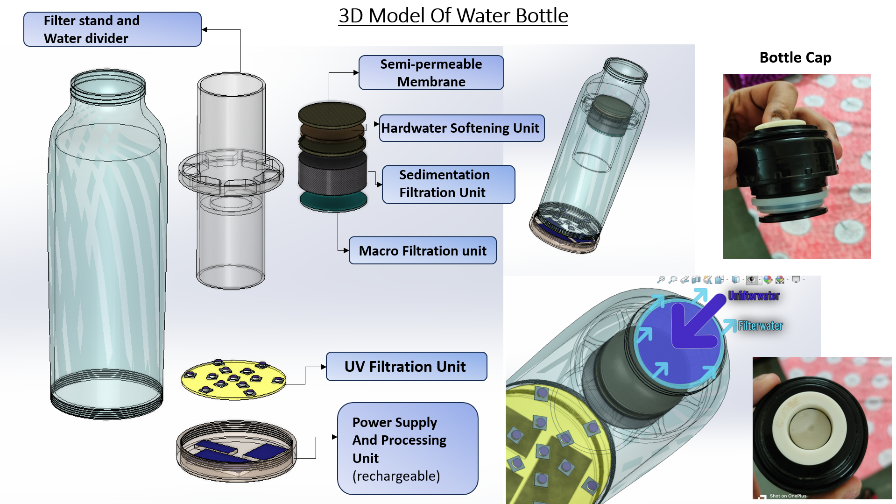
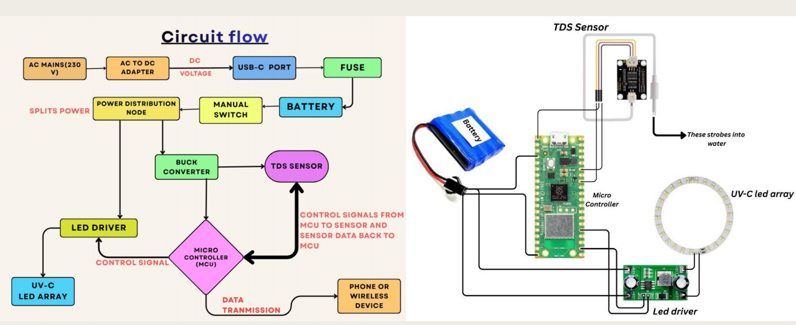

# 💧 Smart Self-Filtering Water Bottle

---

## 📌 Overview
The **Smart Self-Filtering Water Bottle** is a portable and intelligent water purification solution designed to provide **safe drinking water on the go**.  
It integrates **sedimentation filtration, water softening, UV-C sterilization, and real-time water quality monitoring** within a compact bottle.

The system is intended for **travel, rural areas, outdoor activities, and emergency or field use**, where access to clean drinking water is limited.

---

## 📑 Table of Contents
- [Overview](#-overview)
- [Objective](#-objective)
- [Motivation](#-motivation)
- [Problem Identification](#-problem-identification)
- [User Study](#-user-study)
- [Data Analysis & Insights](#-data-analysis--insights)
- [Design Concepts](#-design-concepts)
- [Final Product Design](#-final-product-design)
- [System Working Principle](#-system-working-principle)
- [Electronics & Circuit Flow](#-electronics--circuit-flow)
- [Product Specifications](#-product-specifications)
- [Advantages](#-advantages)
- [Limitations](#-limitations)
- [Future Scope](#-future-scope)
- [License](#-license)
- [Conclusion](#-conclusion)

---

## 🎯 Objective
To design a **portable smart water bottle** capable of:
- Removing sediments and visible impurities
- Reducing water hardness
- Sterilizing water using UV-C light
- Monitoring water purity and quantity in real time

---

## 🚀 Motivation
- Growing demand for **on-the-go water purification**
- Frequent exposure to **hard or contaminated water**
- Lack of compact systems offering **live purity feedback**
- Need for **self-sufficient purification solutions** in remote locations

---

## ❗ Problem Identification
### Limitations of Existing Solutions
- Most bottles only **store water** without purifying it
- Manual purification methods are **slow and inconvenient**
- UV-only bottles fail to address **sediments and hardness**
- No integrated solution combines **filtration, sterilization, and smart sensing**

### Design Goal
Develop a **cost-effective, portable, smart water bottle** that integrates:
- Sedimentation filtration
- Water softening
- UV sterilization
- Real-time purity and quantity monitoring

---

## 👥 User Study
User surveys highlighted:
- High concern for **water safety, taste, and hardness**
- Strong preference for **self-purifying bottles**
- Desired purification time of **2–5 minutes**
- Acceptable price range of **₹3000 – ₹4000**

---

## 📊 Data Analysis & Insights
### Survey Insights
- Portability and reliability are top priorities
- Automated monitoring preferred over manual testing
- Interest in **eco-friendly and rechargeable products**

### Design Implications
- Combine **UV, softener, and sensors** into a single unit
- Provide **mobile-based real-time monitoring**

---

## 💡 Design Concepts
- Concept 1: Sedimentation bottle with replaceable filter  
- Concept 2: UV-only purification bottle  
- Concept 3: **Smart purification bottle (Final Selection)**  
- Concept 4: Solar-powered off-grid version  

**Final Selection:**  
Sedimentation + Water Softening + UV-C Sterilization + Smart Sensing

---

## 🧴 Final Product Design

### 3D Model and Internal Filtration Layout
The image below shows the **3D model of the Smart Self-Filtering Water Bottle**, illustrating its modular internal structure and filtration stages.

Key elements include:
- Sediment filtration unit
- Water softening chamber
- UV-C sterilization module
- Flow divider and membrane
- Detachable electronics module

---

## 🔁 System Working Principle
1. Raw water is poured into the bottle
2. Sediment filter removes visible impurities
3. Charcoal filtration removes chlorine, odor, VOCs, and heavy metals
4. Softener chamber reduces calcium and magnesium ions
5. UV-C LEDs sterilize the water
6. Sensors measure TDS and water quantity
7. Data is displayed on a mobile application  

**Purification Cycle Time:** 2–5 minutes

---

## 🔌 Electronics & Circuit Flow
The diagram below illustrates the **electrical architecture and control flow** of the system.

It includes:
- Rechargeable battery power flow
- Microcontroller-based control
- TDS sensing
- UV-C LED driver
- Wireless data transmission

---

## 📐 Product Specifications

| Parameter | Specification |
|---------|--------------|
| Capacity | 750 ml |
| Filtration | Sedimentation + Softener + UV |
| Sensors | TDS sensor |
| Controller | Embedded microcontroller |
| Connectivity | Bluetooth / Wi-Fi |
| Material | PETG |
| Power | 3.7V Rechargeable Li-ion Battery |
| Charging | USB Type-C |
| Purification Time | 2–5 minutes |
| Estimated Cost | ₹3000 – ₹4000 |

---

## ✅ Advantages
- Compact and portable
- No external pump required
- Multi-stage purification
- Real-time water quality feedback
- Rechargeable and eco-friendly
- Suitable for travel and emergency use

---

## ⚠️ Limitations
- Limited capacity (750 ml)
- Filters require periodic regeneration
- UV performance depends on battery charge
- Not suitable for extremely turbid water

---

## 🔮 Future Scope
- Solar charging integration
- AI-based water quality prediction
- Voice alerts for hydration reminders
- Modular filter replacement
- Higher capacity variants (1L or more)

---

## 📄 License
This project is intended for **academic and educational use**.  
An **MIT License** is recommended for open-source distribution.

---

## 🧾 Conclusion
The **Smart Self-Filtering Water Bottle** offers a **practical, portable, and intelligent solution** for safe drinking water access.  
By combining **mechanical filtration, chemical softening, UV sterilization, and smart monitoring**, the system demonstrates strong potential for real-world deployment.
